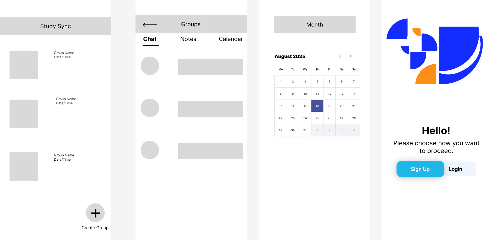

# StudySync – Product Management Case Study

## 📌 Problem Statement
College students often struggle to coordinate group study sessions because scheduling, sharing resources, and tracking progress are spread across multiple apps. This leads to missed meetings, disorganized notes, and reduced productivity. 

**Solution:** StudySync offers a single platform for scheduling, collaborative note-taking, and AI-powered study reminders.

---

## 🧑‍🤝‍🧑 Target Users

### Primary Persona
**Name:** Mia, 20, Sophomore  
- **Traits:** Busy schedule, tech-savvy, works on group projects often.  
- **Goals:** Save time organizing group sessions, keep notes centralized.  
- **Pain Points:** Wastes time chasing people for availability, loses track of shared resources.  

### Secondary Persona
**Name:** Daniel, 22, Senior  
- **Traits:** Works part-time, preparing for grad school.  
- **Goals:** Streamline studying with minimal admin work.  
- **Pain Points:** Struggles to manage group study calendars around work shifts.  

---

## 🎯 Business Goals
- Acquire 1,000 active student users in the first semester.
- Achieve 50% weekly active users (WAU) by month 3.
- Secure partnerships with at least 5 student organizations by end of year.

---

## 🗺 User Journey Map

| Stage       | User Action                            | Touch Point     |
|-------------|----------------------------------------|-----------------|
| Awareness   | Sees ad on Instagram                   | Social Media Ad |
| Onboarding  | Downloads app                          | Mobile App      |
| Core Use    | Creates study group and schedules sessions | In-app calendar |
| Retention   | Uses AI reminders for notes and tasks  | Push notification |

---

## 🎨 Figma Design



---

## 📊 Success Metrics
- **Activation Rate** – % of users who create at least 1 study group in first week.
- **WAU (Weekly Active Users)** – Track engagement over time.
- **Feature Adoption Rate** – % using AI reminders weekly.
- **Session Attendance Rate** – % of scheduled sessions attended by all members.

---

## 🚀 Launch Strategy
- **Phase 1 (Beta)** – Invite-only to 3 campus clubs; collect feedback.
- **Phase 2 (Campus Launch)** – Flyers, partnerships with tutoring centers, Instagram Reels.
- **Phase 3 (Expansion)** – Partner with universities in nearby cities.

---


## 📂 Project Structure (example)
```
study-sync-pm-project/
│
├── README.md
├── PRD.pdf
├── wireframes/
│   ├── home.png
│   ├── group-page.png
│   ├── calendar-view.png
│   └── onboarding.png
├── journey-map.png
└── demo.mp4
```

---

**Author:** Arvind Venkatesh
